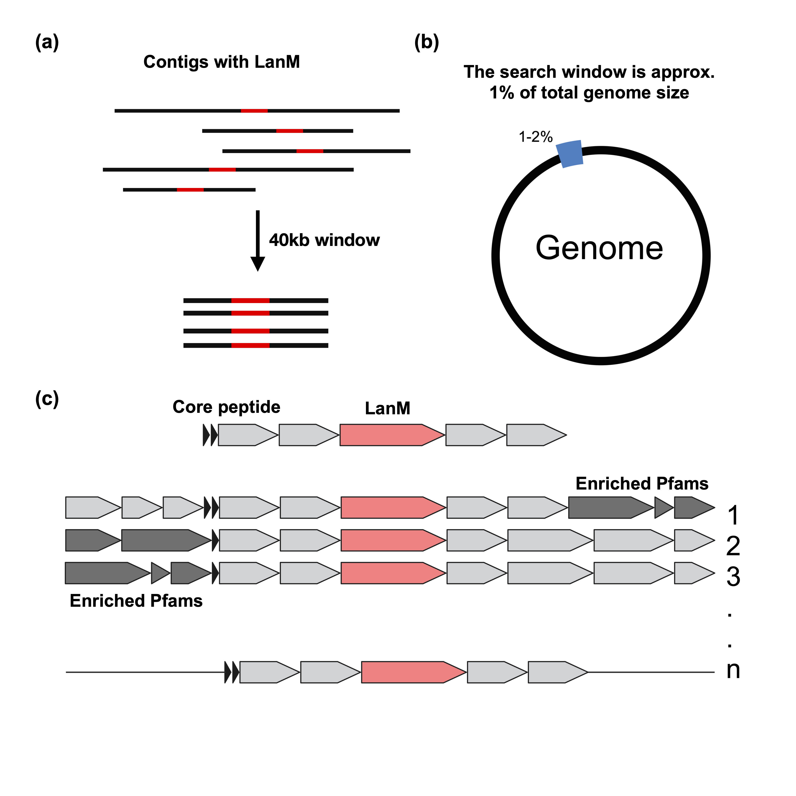

## Co-localisation of lanthipeptide biosynthetic gene clusters (BGC) with genetic determinants implicated in horizontal gene transfer (HGT)
This body of work discovered that there are restriciton modification systems, competenece associated genes, and other genetic determinants that are associated with the lanthipeptide biosynthetic gene clusters (BGC) in the genomes of the lanthipeptide producing bacteria. These elements are localised within 20kb of the BGC. This suggests that the lanthipeptide BGCs are associated with genetic determinants that are involved in horizontal gene transfer (HGT).

## Conclusion
This enrichment of genes encoding DNA defence systems and systems associated with the uptake of exogenous DNA near class II lanthipeptide gene clusters suggests an evolutionary rationale whereby bacterial killing and possibly consequential lysis is linked to genes associated with DNA uptake and horizontal gene transfer. This, coupled with recent evidence showing co-transcription of ribosomally synthesised peptides and phage defence systems, suggests that bacteria-bacteria and bacteria-phage competition are genetically linked traits.

## Code exlanation
The script `make_table.R` creates the control and test datasets. The test datasets consists of class II lanthipeptide BGCs found in Walker et al. (2020). The control dataset consists of genomes that do not contain class II lanthipeptide BGCs and are in RefSeq with a complete genome uploaded. A 40kb region is taken from both the test (lanthipeptide BGCs) and control (non-lanthipeptide BGCs) datasets. The test and control datasets are then used to create the test and control datasets for the enrichment analysis. 

The script `co_localisation_lanthipeptide_II.R` is used to create the enrichment analysis. The script takes the test and control datasets and creates the plots found in the paper. The data needed to re-create these plots is foudn the the folder `data`.

## Contributing

DEHourigan
 
## Contact

For any queries, please reach out via GitHub issues or directly to `114402828@umail.icc.ie`.

---
